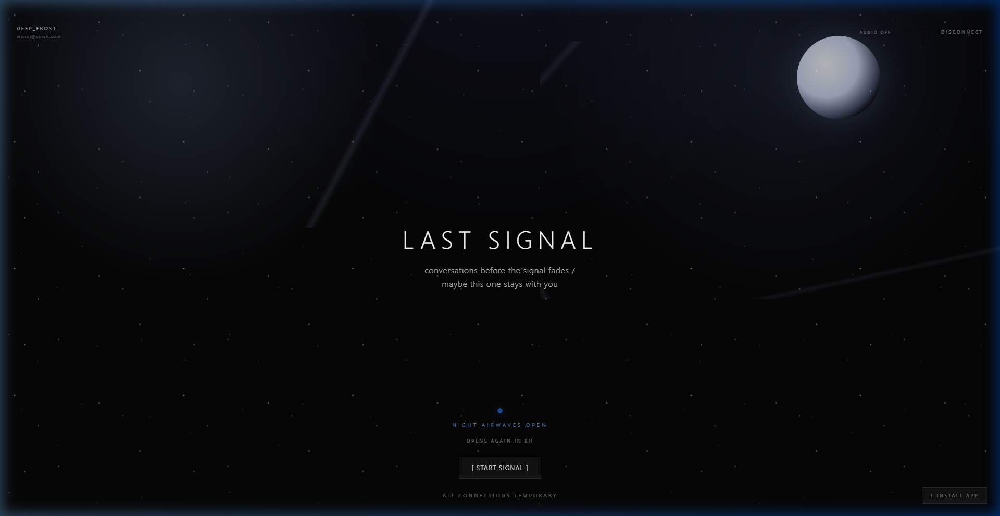
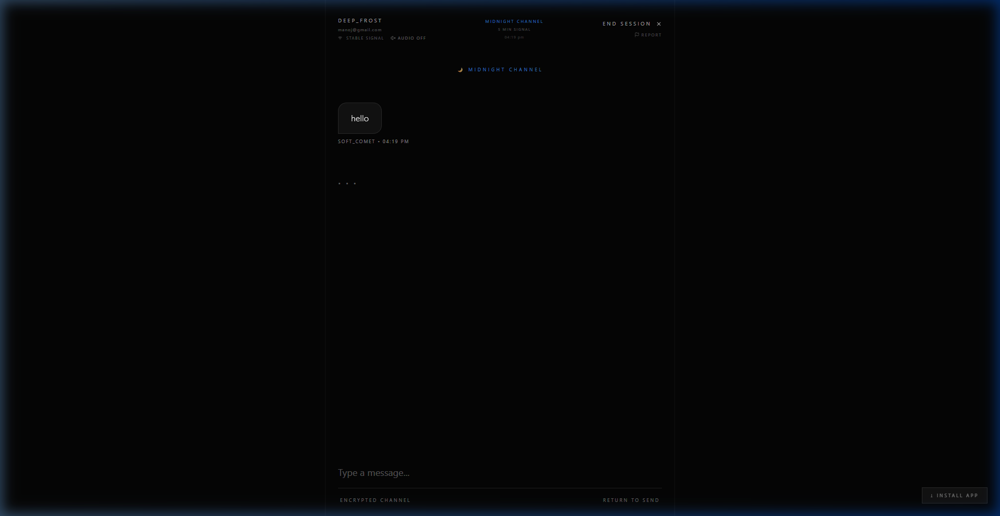
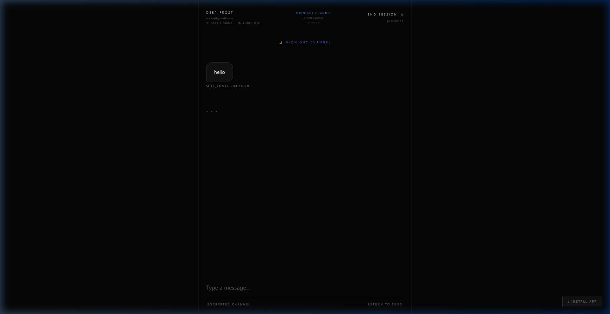
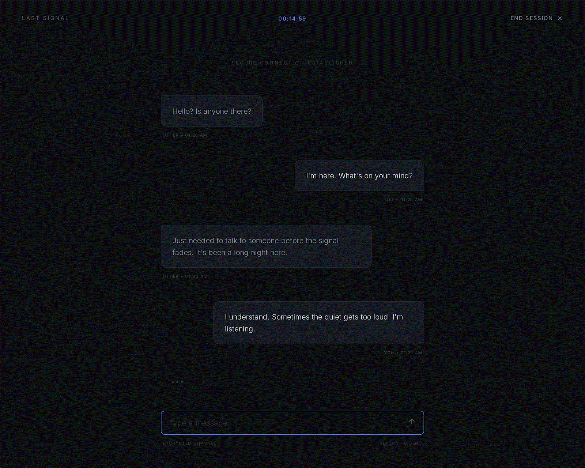

# Last Signal

<p align="center">
  
</p>

<p align="center">
  <strong>A realtime, time-boxed chat product where connection is only possible during rare signal windows.</strong>
</p>

<p align="center">
  
  
  
  
  
  
</p>

## Project Overview

Last Signal explores a product concept built around urgency and emotional context: users can only enter chat when a signal condition is active.

At its heart, the project is meant to support youngsters who stay awake late at night and may be carrying stress, loneliness, or emotional overload. The product direction aims to offer a calm, human moment of connection during those night-owl hours, helping reduce stress through brief, meaningful conversation.

Signal windows:
- Battery mode: battery is 10% or below
- Midnight mode: local time between 12:00 AM and 4:00 AM
- Developer bypass: controlled override for test flows

The app is implemented as a React + Vite Progressive Web App with Firebase Auth, Firestore realtime sync, mode-aware matchmaking, and timed chat sessions.

Important: Last Signal is a peer-connection product and not a replacement for professional mental health care.

## Recruiter Snapshot

This project demonstrates:
- Product thinking: a clear behavioral concept translated into interaction design
- Frontend execution: polished multi-screen React experience with strong motion and state transitions
- Real-time systems work: transactional matchmaking and live Firestore listeners
- Reliability mindset: session expiry, room cleanup, queue cancellation, and reconnection handling
- Engineering discipline: modular architecture, unit tests, linting, and analytics instrumentation

## Role Fit

Strong evidence for:
- Frontend Engineer roles focused on UX quality, state architecture, and performance-aware interaction design
- Full Stack Engineer roles involving realtime data flows, Firebase-backed systems, and product-led delivery
- Product Engineer roles that require translating ambiguous ideas into shippable MVPs

## Portfolio Highlights

- Designed and shipped a complete multi-screen user journey from onboarding to timed disconnect.
- Implemented transactional matchmaking with Firestore queue state isolation by signal mode.
- Built resilient session handling with room expiry, reconnection awareness, and participant presence metadata.
- Added analytics instrumentation for key funnel and chat lifecycle events.
- Wrote focused unit tests for core state and utility modules.

## Key Features

- Real-time 1:1 chat with Firestore subcollections
- Signal-aware matchmaking (battery users with battery users, midnight users with midnight users)
- Timed sessions by mode
  - Battery mode: 3 minutes
  - Midnight mode: 5 minutes
- Presence metadata per participant (connection, visibility, typing state, heartbeat)
- Login and account support (email/password + Google)
- Username claim flow with uniqueness checks
- PWA install support via vite-plugin-pwa
- Firebase Analytics event tracking with a local debug buffer fallback

## Technical Highlights

- Matchmaker transaction model
  - A single Firestore document stores mode-specific queues.
  - Firestore transactions atomically enqueue users or create a room when a partner exists.

- Session lifecycle and cleanup
  - Rooms are created with explicit expiry and lifecycle status metadata.
  - Ended rooms are marked and cleaned up (messages + room document).
  - App can restore active sessions after refresh/auth restore.

- Presence and connection resilience
  - Participant state tracks connection, visibility, typing, and last-seen timestamps.
  - Listeners gracefully handle permission and closed-room edge cases.

- State architecture
  - A reducer-based app flow centralizes screen transitions and session state.
  - Signal mode logic is normalized in reusable utilities for deterministic behavior.

## Why This Project Matters

- It shows end-to-end ownership from concept and UX framing to data model and deployment-ready setup.
- It balances product feel and engineering rigor instead of optimizing one at the cost of the other.
- It is constrained by real-world browser and realtime-system limitations, with practical fallbacks.
- It is intentionally designed to support stressed late-night users with low-pressure social connection.

## Screenshots

### Landing



### Connecting


### Chat



### Session Timer



### Disconnect


## Quick Demo GIF



This quick-loop demo gives recruiters a fast visual pass before opening the app locally.

Tip: replace pages/demo.gif with a short multi-screen recording for a stronger portfolio first impression.

## Tech Stack

- Frontend: React 19, Vite, Tailwind CSS, Framer Motion
- Backend: Firebase Authentication, Firestore, Firebase Analytics
- PWA: vite-plugin-pwa, service worker, install prompt support
- Tooling: ESLint, Vitest

## Architecture (High Level)

Client (React PWA)
-> Firebase Authentication
-> Firestore (users, chatRooms, messages, matchmaker)
-> Realtime listeners + transactional matchmaking

## Workspace Structure

- `last-signal/`: main app codebase
- `pages/`: recruiter-ready visual assets and UI screenshots
- `PRODUCT REQUIREMENTS DOCUMENT (PRD).txt`: product goals and scope
- `TECHNICAL REQUIREMENTS DOCUMENT (TRD).txt`: technical architecture direction

## Run Locally

```bash
cd last-signal
npm install
npm run dev
```

Create a .env file in last-signal/ with:

```bash
VITE_FIREBASE_API_KEY=
VITE_FIREBASE_AUTH_DOMAIN=
VITE_FIREBASE_PROJECT_ID=
VITE_FIREBASE_STORAGE_BUCKET=
VITE_FIREBASE_MESSAGING_SENDER_ID=
VITE_FIREBASE_APP_ID=
VITE_FIREBASE_MEASUREMENT_ID=
```

## Validation

```bash
cd last-signal
npm run lint
npm run test
npm run build
```

## Firebase Setup Notes

1. Deploy last-signal/firestore.rules to your Firebase project.
2. Configure Firestore TTL on chatRooms.expiresAt for automatic expiration cleanup.
3. Enable Firebase Authentication providers you plan to use:
  - Email/Password
  - Google

## Testing Coverage

Unit tests currently cover:
- App flow reducer behavior
- Matchmaker queue logic
- Signal mode utilities
- Moderation and session history helpers
- Username generator behavior

## What This Project Shows About The Engineer

- Ability to take a product concept and ship a cohesive MVP
- Comfort with realtime architecture and eventual consistency concerns
- Strong attention to UX polish under technical constraints
- Practical use of observability (analytics + debug buffers)
- Clean separation of concerns across hooks, screens, and shared libs

## Roadmap

- Sentiment-aware matching service
- Push notification improvements
- Expanded moderation workflow
- Session recap exports and richer analytics dashboards

